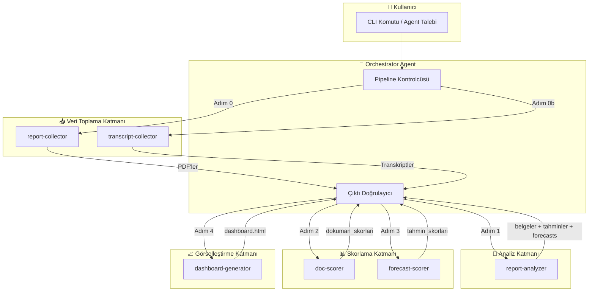
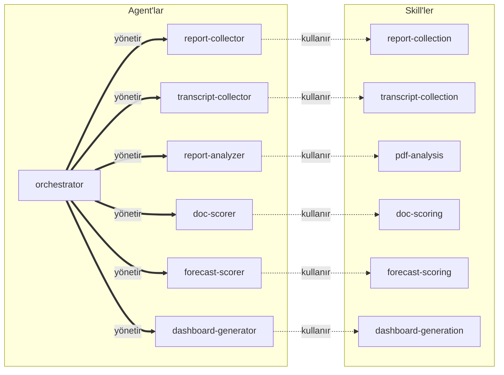
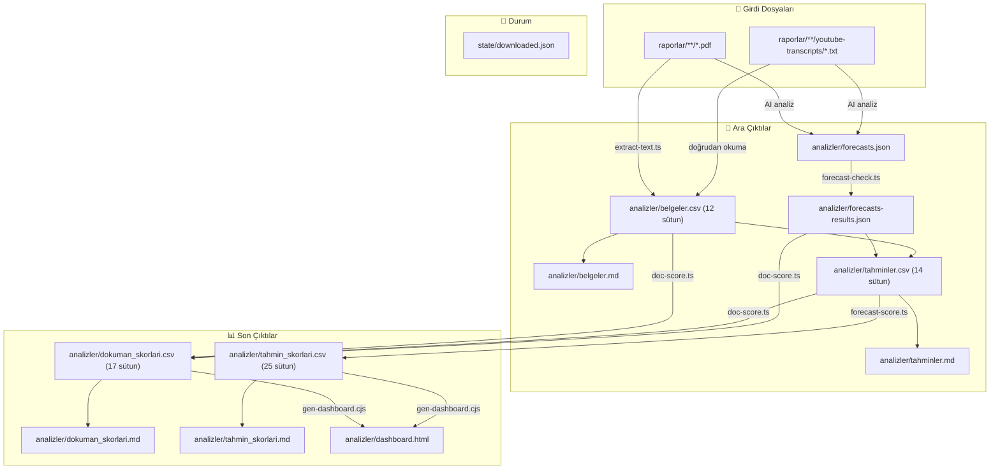
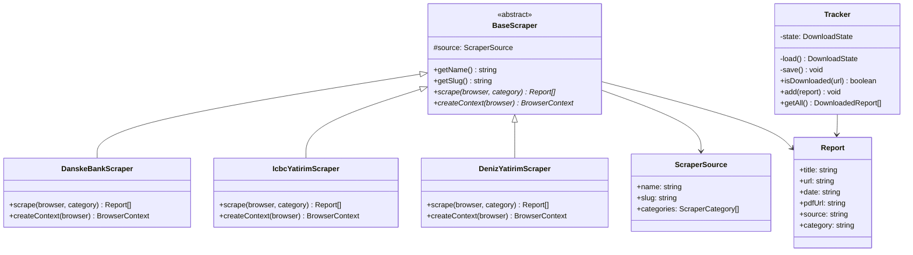
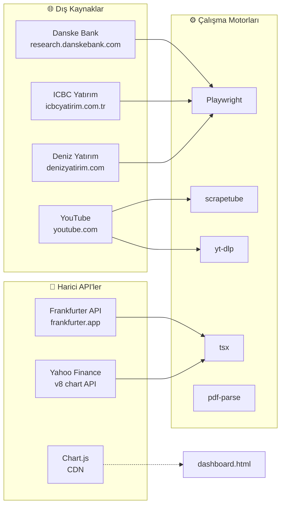

# 🏗️ Piyasa Analiz — Mimari Doküman

> **Proje**: Yatırım araştırma raporları (PDF) ve YouTube transkriptlerinden otomatik veri toplama, yapılandırılmış analiz, performans skorlama ve interaktif dashboard üretim sistemi.

**Son Güncelleme**: 15 Nisan 2026

---

## 📋 İçindekiler

1. [Genel Bakış](#1-genel-bakış)
2. [Sistem Mimarisi](#2-sistem-mimarisi)
3. [Agent Mimarisi](#3-agent-mimarisi)
4. [Pipeline Akışı](#4-pipeline-akışı)
5. [Veri Akışı ve Dosya Haritası](#5-veri-akışı-ve-dosya-haritası)
6. [Kaynak Kod Yapısı](#6-kaynak-kod-yapısı)
7. [Scraper Mimarisi](#7-scraper-mimarisi)
8. [Analiz ve Skorlama Motoru](#8-analiz-ve-skorlama-motoru)
9. [Harici API'ler ve Bağımlılıklar](#9-harici-apiler-ve-bağımlılıklar)
10. [Durum Yönetimi](#10-durum-yönetimi)
11. [Dashboard Mimarisi](#11-dashboard-mimarisi)
12. [Güvenlik ve Kısıtlamalar](#12-güvenlik-ve-kısıtlamalar)
13. [Genişletilebilirlik](#13-genişletilebilirlik)

---

## 1. Genel Bakış

Piyasa Analiz, **iki teknoloji yığınını** bir arada kullanan hibrit bir sistemdir:

| Katman | Teknoloji | Amaç |
|--------|-----------|------|
| **PDF Scraping** | Node.js + TypeScript + Playwright | Finans kuruluşlarından yatırım raporları (PDF) indirme |
| **Transkript Toplama** | Python + scrapetube + yt-dlp | YouTube kanallarından video transkriptleri çekme |
| **Analiz** | TypeScript scriptleri + AI (LLM) | PDF metin çıkarma, yapılandırılmış analiz tabloları oluşturma |
| **Skorlama** | TypeScript (deterministik) | Belge ve tahmin bazında performans skorlama |
| **Dashboard** | Node.js (CJS) + Chart.js | İnteraktif HTML dashboard üretimi |
| **Orkestrasyon** | VS Code Agent Protocol | 7 agent + 6 skill ile pipeline yönetimi |

### Temel Prensip

```
Ham Veri → Yapılandırılmış Analiz → Performans Skorlama → Görsel Dashboard
```

**Build adımı yoktur** — tüm TypeScript dosyaları `tsx` ile doğrudan çalıştırılır.

---

## 2. Sistem Mimarisi

### Üst Düzey Mimari Diyagramı



### Katmanlı Mimari

```
┌──────────────────────────────────────────────────────┐
│                  Görselleştirme Katmanı               │
│  dashboard-generator → dashboard.html (Chart.js)      │
├──────────────────────────────────────────────────────┤
│                   Skorlama Katmanı                    │
│  doc-scorer (doc-score.ts)  │  forecast-scorer        │
│  → dokuman_skorlari.csv     │  (forecast-score.ts)    │
│                             │  → tahmin_skorlari.csv  │
├──────────────────────────────────────────────────────┤
│                    Analiz Katmanı                      │
│  report-analyzer                                      │
│  ├─ extract-text.ts (PDF → metin)                     │
│  ├─ AI analiz (belgeler + tahminler tabloları)        │
│  ├─ forecasts.json → forecast-check.ts                │
│  └─ forecasts-results.json (sapma + alpha)            │
├──────────────────────────────────────────────────────┤
│                Veri Toplama Katmanı                    │
│  report-collector          │  transcript-collector     │
│  (Playwright + fetch)      │  (scrapetube + yt-dlp)   │
│  → raporlar/**/*.pdf       │  → raporlar/**/*.txt     │
├──────────────────────────────────────────────────────┤
│                  Durum Yönetimi                        │
│  state/downloaded.json (URL bazlı duplicate kontrolü) │
└──────────────────────────────────────────────────────┘
```

---

## 3. Agent Mimarisi

Sistem, VS Code Agent Protocol üzerinde çalışan **7 agent** ve **6 skill** dosyasından oluşur.

### Agent — Skill Eşleştirme Haritası



### Agent Detay Tablosu

| # | Agent | Dosya Yolu | Yetkilendirilen Araçlar | Görev | Girdi | Çıktı |
|---|-------|------------|------------------------|-------|-------|-------|
| 🎯 | **orchestrator** | `.github/agents/orchestrator.agent.md` | `agent`, `read`, `search`, `todo` | Tüm pipeline'ı sıralı yönetir | Kullanıcı talebi | Pipeline özeti |
| 📥 | **report-collector** | `.github/agents/report-collector.agent.md` | `execute`, `read`, `edit`, `search` | PDF raporları indirir | Web kaynakları | `raporlar/**/*.pdf` |
| 📥 | **transcript-collector** | `.github/agents/transcript-collector.agent.md` | `execute`, `read`, `edit`, `search` | YouTube transkriptleri çeker | YouTube kanalları | `raporlar/**/*.txt` |
| 🔬 | **report-analyzer** | `.github/agents/report-analyzer.agent.md` | `execute`, `read`, `edit`, `search` | PDF + transkript analizi yapar | PDF/TXT dosyaları | `belgeler.csv`, `tahminler.csv`, `forecasts.json` |
| 📊 | **doc-scorer** | `.github/agents/doc-scorer.agent.md` | `execute`, `read`, `search` | Belge bazında skorlama yapar | `belgeler.csv`, `tahminler.csv`, `forecasts-results.json` | `dokuman_skorlari.csv` |
| 📊 | **forecast-scorer** | `.github/agents/forecast-scorer.agent.md` | `execute`, `read`, `search` | Tahmin bazında skorlama yapar | `tahminler.csv` | `tahmin_skorlari.csv` |
| 📈 | **dashboard-generator** | `.github/agents/dashboard-generator.agent.md` | `execute`, `read`, `search` | İnteraktif HTML dashboard üretir | `dokuman_skorlari.csv`, `tahmin_skorlari.csv` | `dashboard.html` |

### Skill Detay Tablosu

| Skill | Dosya Yolu | Kullanan Agent | İçerik |
|-------|------------|----------------|--------|
| **report-collection** | `.github/skills/report-collection/SKILL.md` | report-collector | Scraper mimarisi, BaseScraper API, yeni kaynak ekleme prosedürü |
| **transcript-collection** | `.github/skills/transcript-collection/SKILL.md` | transcript-collector | Python script kullanımı, kanal ekleme, rate limit kuralları |
| **pdf-analysis** | `.github/skills/pdf-analysis/SKILL.md` | report-analyzer | 3 fazlı analiz prosedürü, 12+14 sütun tanımları, forecast çıkarma |
| **doc-scoring** | `.github/skills/doc-scoring/SKILL.md` | doc-scorer | 17 sütun, başarı skoru formülü, alpha hesaplama |
| **forecast-scoring** | `.github/skills/forecast-scoring/SKILL.md` | forecast-scorer | 25 sütun, MAPE, trailing alpha, öneri kural sistemi |
| **dashboard-generation** | `.github/skills/dashboard-generation/SKILL.md` | dashboard-generator | 3 dosyalık generator, 4 tab, KPI metrikleri |

### Agent İletişim Modeli

Agent'lar **doğrudan birbirleriyle haberleşmez**. Tüm koordinasyon **orchestrator** tarafından yönetilir:

```
orchestrator ──[sub-agent çağrısı]──> report-collector
                                      ↓ (dosya sistemi üzerinden)
orchestrator ──[sub-agent çağrısı]──> report-analyzer
                                      ↓ (dosya sistemi üzerinden)
orchestrator ──[sub-agent çağrısı]──> doc-scorer
```

**Haberleşme mekanizması**: Dosya sistemi (shared file system). Bir agent'ın çıktı dosyaları, bir sonraki agent'ın girdi dosyalarıdır. Orchestrator her adımda çıktı dosyalarının varlığını doğrular.

---

## 4. Pipeline Akışı

### Tam Pipeline (Sıralı Yürütme)

```mermaid
sequenceDiagram
    participant U as 👤 Kullanıcı
    participant O as 🎯 Orchestrator
    participant RC as 📥 Report Collector
    participant TC as 📥 Transcript Collector
    participant RA as 🔬 Report Analyzer
    participant DS as 📊 Doc Scorer
    participant FS as 📊 Forecast Scorer
    participant DG as 📈 Dashboard Generator

    U->>O: "Tam analiz çalıştır"
    
    rect rgb(22, 33, 62)
        Note over RC,TC: Adım 0 — Veri Toplama
        O->>RC: Raporları indir
        RC->>RC: Playwright → PDF'ler
        RC-->>O: ✓ N yeni PDF
        O->>TC: Transkriptleri çek
        TC->>TC: scrapetube + yt-dlp → TXT'ler
        TC-->>O: ✓ M yeni transkript
    end

    rect rgb(26, 26, 46)
        Note over RA: Adım 1 — Analiz (3 Faz)
        O->>RA: Tüm raporları analiz et
        RA->>RA: Faz 1: Belgeler raporu (12 sütun)
        RA->>RA: Faz 2: forecasts.json → forecast-check.ts → forecasts-results.json
        RA->>RA: Faz 3: Tahminler raporu (14 sütun)
        RA-->>O: ✓ belgeler.csv + tahminler.csv + forecasts-results.json
    end

    rect rgb(22, 33, 62)
        Note over DS,FS: Adım 2-3 — Skorlama
        O->>DS: Belge skorlama
        DS->>DS: doc-score.ts → dokuman_skorlari.csv (17 sütun)
        DS-->>O: ✓ dokuman_skorlari.csv
        O->>FS: Tahmin skorlama
        FS->>FS: forecast-score.ts → tahmin_skorlari.csv (25 sütun)
        FS-->>O: ✓ tahmin_skorlari.csv
    end

    rect rgb(26, 26, 46)
        Note over DG: Adım 4 — Dashboard
        O->>DG: Dashboard üret
        DG->>DG: gen-dashboard.cjs → dashboard.html
        DG-->>O: ✓ dashboard.html
    end

    O-->>U: Pipeline tamamlandı (özet)
```



### Report-Analyzer İç Akışı (3 Faz)

```
┌─ FAZ 1: Temel Analiz ───────────────────────────────────────────┐
│  PDF → extract-text.ts → ham metin                              │
│  TXT → doğrudan okuma → ham metin                               │
│  Ham metin → AI analiz → belgeler.csv (12 sütun)                │
│  Sütunlar: Belge Tarihi, Kurum, Analistler, Format, Belge Adı, │
│            Özet Metin, Yatırım Tezi, Varsayımlar, Risk Analizi, │
│            Varsayım Gerçekleşme, Tahmin Sapması, Kaynak         │
└──────────────────────────────────────────────────────────────────┘
              ↓
┌─ FAZ 2: Forecast & Varsayım ────────────────────────────────────┐
│  Her rapor/transkript → AI → forecasts.json                     │
│  forecasts.json → forecast-check.ts:                            │
│    ├─ Cross-report: Rapor N +1M → Rapor N+1 spot               │
│    ├─ API fallback: Son rapor → Frankfurter / Yahoo Finance     │
│    └─ Split düzeltmesi: Yahoo adjclose/close oranı              │
│  Çıktı: forecasts-results.json (sapma + alpha pip/pct)          │
│  Ardışık rapor çiftleri → AI varsayım gerçekleşme (✅/❌/⚠️/⏳)  │
│  belgeler.csv Faz 2 sütunları doldurulur                        │
└──────────────────────────────────────────────────────────────────┘
              ↓
┌─ FAZ 3: Tahminler Raporu ────────────────────────────────────────┐
│  forecasts-results.json → Her rapor × parite × vade = 1 satır   │
│  tahminler.csv (14 sütun)                                       │
│  Sütunlar: Tahmin Tarihi, Kurum, Analist, Format, Belge Adı,   │
│            Varlık, Vade, Hedef Tarihi, Spot Fiyat, Hedef Fiyat, │
│            Analiz Tezi, Gerçekleşen Fiyat, Sapma (pip),         │
│            Yön İsabeti                                           │
└──────────────────────────────────────────────────────────────────┘
```

---

## 5. Veri Akışı ve Dosya Haritası

### Dosya Bağımlılık Grafiği



### Dosya Yapısı ve Açıklamaları

```
piyasa-analiz/
├── 📄 package.json              # Proje tanımı, npm scriptleri
├── 📄 tsconfig.json             # TypeScript strict mode, ESM
├── 📄 requirements.txt          # Python bağımlılıkları (scrapetube, yt-dlp)
├── 📄 README.md                 # Proje dokümantasyonu
│
├── 📂 src/                      # Kaynak kod
│   ├── config.ts                # CONFIG ayarları + SOURCES dizisi
│   ├── index.ts                 # Ana giriş: main(), createScraper() factory
│   ├── types.ts                 # TypeScript arayüzleri
│   ├── tracker.ts               # Duplicate kontrolü (state/downloaded.json)
│   ├── downloader.ts            # PDF indirme (Playwright + fetch)
│   │
│   ├── 📂 scrapers/             # Web scraper'lar
│   │   ├── base-scraper.ts      # Abstract base class
│   │   ├── danske-bank.ts       # Danske Bank FX Forecast Update
│   │   ├── icbc-yatirim.ts      # ICBC Yatırım Model Portföy
│   │   └── deniz-yatirim.ts     # Deniz Yatırım Günlük Bülten
│   │
│   ├── 📂 analyzer/             # Analiz ve skorlama scriptleri
│   │   ├── extract-text.ts      # PDF → metin çıkarma (pdf-parse)
│   │   ├── generate-analysis.ts # Analiz üretimi
│   │   ├── forecast-check.ts    # Tahmin sapması hesaplama (API entegrasyonu)
│   │   ├── doc-score.ts         # Belge bazında skorlama (17 sütun)
│   │   └── forecast-score.ts    # Tahmin bazında skorlama (25 sütun)
│   │
│   └── 📂 transcript/           # YouTube transkript toplama
│       └── fetch-transcripts.py # Python script (scrapetube + yt-dlp)
│
├── 📂 raporlar/                 # İndirilen veriler
│   ├── danske-bank/fx-forecast-update/     # PDF'ler
│   ├── icbc-yatirim/model-portfoy/         # PDF'ler
│   ├── deniz-yatirim/gunluk-bulten/        # PDF'ler
│   └── devrim-akyil/youtube-transcripts/   # TXT transkriptler
│
├── 📂 analizler/                # Analiz çıktıları
│   ├── belgeler.csv/md          # Belge bazlı analiz (12 sütun)
│   ├── tahminler.csv/md         # Tahmin bazlı analiz (14 sütun)
│   ├── forecasts.json           # Ham forecast verisi
│   ├── forecasts-results.json   # Sapma + alpha hesaplamaları
│   ├── dokuman_skorlari.csv/md  # Belge skorları (17 sütun)
│   ├── tahmin_skorlari.csv/md   # Tahmin skorları (25 sütun)
│   └── dashboard.html           # İnteraktif dashboard
│
├── 📂 state/                    # Kalıcı durum
│   └── downloaded.json          # URL bazlı duplicate kayıtları
│
├── 📂 .github/
│   ├── copilot-instructions.md  # Proje kuralları
│   ├── 📂 agents/               # Agent tanım dosyaları (7 adet)
│   └── 📂 skills/               # Skill dosyaları (6 adet)
│
└── 📂 .copilot-temp/            # Dashboard generator dosyaları
    ├── gen-dashboard.cjs        # Ana generator script
    ├── dashboard-styles.css     # Dark-theme CSS
    └── dashboard-browser.js     # Client-side JS (Chart.js)
```

---

## 6. Kaynak Kod Yapısı

### npm Scriptleri

| Script | Komut | Açıklama |
|--------|-------|----------|
| `start` | `tsx src/index.ts` | Tüm kaynakların raporlarını indir |
| `start:debug` | `tsx src/index.ts --debug` | Headless=false ile debug modu |
| `analyze` | `tsx src/analyzer/generate-analysis.ts` | Analiz üretimi |
| `extract` | `tsx src/analyzer/extract-text.ts` | PDF metin çıkarma |
| `forecast-check` | `tsx src/analyzer/forecast-check.ts` | Tahmin sapması hesaplama |
| `doc-score` | `tsx src/analyzer/doc-score.ts` | Belge skorlama |
| `forecast-score` | `tsx src/analyzer/forecast-score.ts` | Tahmin skorlama |
| `transcript` | `python3 src/transcript/fetch-transcripts.py` | Transkript toplama |

### Teknoloji Yığını

| Kategori | Teknoloji | Versiyon | Kullanım Alanı |
|----------|-----------|----------|----------------|
| **Runtime** | Node.js | — | TypeScript çalıştırma |
| **TS Runner** | tsx | ^4.19.0 | Build'siz TS execution |
| **Language** | TypeScript | ^5.7.0 | Strict mode, ESM modules |
| **Browser** | Playwright | ^1.49.0 | Web scraping (Chromium) |
| **PDF** | pdf-parse | ^2.4.5 | PDF metin çıkarma |
| **Python** | Python 3 | — | Transkript toplama |
| **Video** | scrapetube | — | YouTube kanal video listesi |
| **Transcript** | yt-dlp | — | YouTube altyazı indirme |
| **Charts** | Chart.js | CDN | Dashboard grafikleri |

---

## 7. Scraper Mimarisi

### Sınıf Hiyerarşisi



### Factory Pattern

`src/index.ts` içindeki `createScraper()` fonksiyonu, `source.slug` değerine göre uygun scraper instance'ını oluşturur:

```typescript
function createScraper(source: ScraperSource): BaseScraper {
  switch (source.slug) {
    case "danske-bank":    return new DanskeBankScraper(source);
    case "icbc-yatirim":   return new IcbcYatirimScraper(source);
    case "deniz-yatirim":  return new DenizYatirimScraper(source);
    default: throw new Error(`Bilinmeyen kaynak: ${source.slug}`);
  }
}
```

### PDF İndirme Stratejisi

```
PDF indirme kararı:
├── Auth gerekli mi?
│   ├── Evet → Playwright navigasyonu (downloadReport)
│   │          Page.goto(pdfUrl) → waitForEvent("download")
│   └── Hayır → Native fetch (downloadReportDirect)
│               fetch(pdfUrl, { headers: { Cookie } }) → fs.writeFile
```

### Desteklenen Kaynaklar

| Kurum | Slug | Kategori | Scraping Yöntemi | URL |
|-------|------|----------|------------------|-----|
| Danske Bank | `danske-bank` | FX Forecast Update | API intercept + HTML fallback | research.danskebank.com |
| ICBC Yatırım | `icbc-yatirim` | Model Portföy | HTML scraping | icbcyatirim.com.tr |
| Deniz Yatırım | `deniz-yatirim` | Günlük Bülten | HTML scraping | denizyatirim.com |
| Devrim Akyıl | `devrim-akyil` | YouTube Transkript | scrapetube + yt-dlp | youtube.com/@DevrimAkyıl |

---

## 8. Analiz ve Skorlama Motoru

### Analiz Sütunları Özeti

```
belgeler.csv (12 sütun)
├── Belge Tarihi, Kurum, Analistler, Format, Belge Adı
├── Özet Metin, Yatırım Tezi, Varsayımlar, Risk Analizi
├── Varsayım Gerçekleşme (✅/❌/⚠️/⏳)
├── Tahmin Sapması (pip + %)
└── Kaynak (YouTube URL veya boş)

tahminler.csv (14 sütun)
├── Tahmin Tarihi, Kurum, Analist, Format, Belge Adı
├── Varlık, Vade, Hedef Tarihi
├── Spot Fiyat, Hedef Fiyat, Analiz Tezi
├── Gerçekleşen Fiyat, Sapma (pip)
└── Yön İsabeti (✅/❌/⏳)

dokuman_skorlari.csv (17 sütun)
├── Belge meta verileri (7 sütun)
├── Varsayım Etkisi (Yüksek/Orta/Düşük)
├── Risk Analizi, Kaynak
├── Varlık Sayısı, Tahmin Sayısı, İsabet Oranı %
├── Ort. Alpha (Consensus), Ort. Alpha (Forward)
└── Belge Başarı Skoru (0-100 + harf notu)

tahmin_skorlari.csv (25 sütun)
├── Tahmin meta verileri (9 sütun)
├── Benchmark, Tahmin tarihindeki Fiyat
├── Beklenen/Gerçekleşen Getiri %, Hedef Yön
├── Öneri (Buy/Sell/Bullish/Bearish)
├── Yön İsabeti, Hedef Yakınlığı, Tahmin Doğruluğu
├── Error (MAPE), Başarı Skoru (0-100)
├── Ref. Beklenen/Gerçekleşen Getiri %
└── Alpha, RefAlpha
```

### Belge Başarı Skoru Formülü

```
                  ┌─────────────────────────────────────────────┐
                  │         Belge Başarı Skoru (0-100)          │
                  │                                             │
                  │  Alpha verisi varken:                       │
                  │  ┌──────────────┬──────┐                   │
                  │  │ Yön İsabeti  │ ×0.40│ ─── ✅/(✅+❌)×100│
                  │  ├──────────────┼──────┤                   │
                  │  │ Hedef Yakın. │ ×0.30│ ─── Sapma% → skor│
                  │  ├──────────────┼──────┤                   │
                  │  │ Alpha Skoru  │ ×0.20│ ─── Alpha% → skor│
                  │  ├──────────────┼──────┤                   │
                  │  │ Varsayım Doğ.│ ×0.10│ ─── ✅×1+⚠×0.5   │
                  │  └──────────────┴──────┘                   │
                  │                                             │
                  │  Alpha verisi yokken:                       │
                  │  Yön×0.50 + Hedef×0.35 + Varsayım×0.15     │
                  │                                             │
                  │  Harf: A≥85, B≥70, C≥55, D≥40, F<40       │
                  └─────────────────────────────────────────────┘
```

### Tahmin Başarı Skoru Formülü

```
Başarı = (Yön İsabeti×100 × 0.40)
       + (Hedef Yakınlığı × 0.30)        ← max(0, 100 − MAPE×10)
       + (Alpha Skoru × 0.20)             ← Alpha% → 0-100 normalize
       + (Tahmin Doğruluğu × 0.10)        ← MAPE kırılımlı skor
```

### Öneri Kural Sistemi

```
Varlık Tipi belirlenir:
├── FX Paritesi → Bullish/Bearish terminolojisi (7 kademe)
│   Strong Bearish ← Bearish ← Slightly Bearish ← Neutral →
│   Slightly Bullish → Bullish → Strong Bullish
│
└── Hisse Senedi → Buy/Sell terminolojisi (6 kademe)
    Strong Sell ← Sell ← Reduce ← Hold → Buy → Strong Buy

Adım 1: Alpha bazlı temel öneri
Adım 2: RefAlpha conviction düzeltmesi (|RefAlpha| > 0.5 → ±1 kademe)
```

### Pip Birimleri

| Parite Tipi | 1 Pip | Çarpan |
|-------------|-------|--------|
| Standart FX (EUR/USD, vb.) | 0.0001 | ×10000 |
| JPY pariteler (EUR/JPY, USD/JPY) | 0.01 | ×100 |
| Hisse / Emtia | 1 birim (TL/USD) | ×1 |

### Hisse Senedi Split Tespiti

`forecast-check.ts`, Yahoo Finance'ten `adjclose/close` oranı ile otomatik split tespiti yapar. Split algılandığında:
- `splitRatio` alanı `forecasts-results.json`'a eklenir
- Spot ve forecast değerleri split-sonrası bazına dönüştürülür
- Tahminler/skorlama tabloları düzeltilmiş değerleri kullanır

---

## 9. Harici API'ler ve Bağımlılıklar

### API Haritası



### API Detayları

| API | URL | Kullanım | Kullanan Script | Protokol |
|-----|-----|----------|-----------------|----------|
| **Frankfurter** | `api.frankfurter.app` | FX parite fiyatları (EUR-bazlı cross rates) | `forecast-check.ts`, `forecast-score.ts` | REST (JSON) |
| **Yahoo Finance** | `query1.finance.yahoo.com/v8/finance/chart/` | BIST hisse fiyatları (`TICKER.IS`), BIST100 (`XU100.IS`), split tespiti | `forecast-check.ts`, `forecast-score.ts` | REST (JSON) |
| **Chart.js** | `cdn.jsdelivr.net` | Dashboard grafikler (client-side) | `dashboard.html` (tarayıcıda) | CDN (JS) |
| **YouTube** | `youtube.com` | Video listesi + transkript | `fetch-transcripts.py` | scrapetube + yt-dlp |

### Frankfurter API Kullanım Detayı

```
GET https://api.frankfurter.app/{date}?from=EUR&to=USD,SEK,NOK,...

Kullanım alanları:
1. forecast-check.ts: Son raporun tahminleri için güncel kur
2. forecast-score.ts: Trailing benchmark fiyatları (N ay önceki spot)

Özellikler:
- Ücretsiz, API key gerektirmez
- EUR-bazlı cross rate'ler
- Hafta sonu tarihleri için en yakın iş gününü döndürür
```

### Yahoo Finance API Kullanım Detayı

```
GET https://query1.finance.yahoo.com/v8/finance/chart/{ticker}.IS
    ?period1={unix_start}&period2={unix_end}&interval=1d

Kullanım alanları:
1. forecast-check.ts: BIST hisse gerçekleşen fiyatları + split tespiti
2. forecast-score.ts: BIST100 trailing benchmark (XU100.IS)

Split tespiti:
- adjclose / close oranı ≠ 1 → split algılanır
- splitRatio = close / adjclose
- Rapordaki değerler otomatik düzeltilir
```

---

## 10. Durum Yönetimi

### `state/downloaded.json`

Tüm indirme işlemleri (PDF + transkript) tek bir state dosyasını paylaşır:

```json
{
  "reports": [
    {
      "url": "https://research.danskebank.com/...",    // Duplicate key
      "title": "FX Forecast Update Mar 2026",
      "downloadedAt": "2026-03-20T14:30:00.000Z",
      "filePath": "raporlar/danske-bank/fx-forecast-update/2026-03-20_fx-forecast..."
    },
    {
      "url": "https://www.youtube.com/watch?v=ABC123", // YouTube URL
      "title": "Altın Gümüş Analizi",
      "downloadedAt": "2026-03-21T10:15:00.000Z",
      "filePath": "raporlar/devrim-akyil/youtube-transcripts/2026-03-21_altin-gumus..."
    }
  ]
}
```

**Duplicate Kontrolü**: URL bazlı (`Tracker.isDownloaded(url)`)
- Her PDF URL'si ve YouTube video URL'si benzersiz anahtar olarak kullanılır
- Aynı URL ikincil kez işlenmez

**Yönetici**: `Tracker` sınıfı (`src/tracker.ts`)
- `load()`: Dosyadan okur
- `save()`: Her yeni kayıtta dosyayı günceller
- `isDownloaded(url)`: Daha önce indirilmiş mi kontrolü
- `add(report)`: Yeni kayıt ekler ve disk'e yazar

---

## 11. Dashboard Mimarisi

### Generator Pipeline

```
.copilot-temp/gen-dashboard.cjs
├── Okur: analizler/dokuman_skorlari.csv
├── Okur: analizler/tahmin_skorlari.csv
├── Okur: .copilot-temp/dashboard-styles.css
├── Okur: .copilot-temp/dashboard-browser.js
├── KPI hesaplar (belge/tahmin sayısı, ort. skor, isabet oranı)
├── Verileri JSON olarak HTML'ye gömer
├── CSS + JS inlinelar (self-contained)
└── Yazar: analizler/dashboard.html
```

### Dashboard Yapısı

| Tab | İçerik | Etkileşim |
|-----|--------|-----------|
| **Genel Bakış** | 4 KPI kartı + 4 grafik (skor dağılımı, harf notu, kurum karşılaştırma, zaman serisi) | — |
| **Belgeler** | Sıralanabilir tablo, tıklanabilir satırlar | Satır tıkla → modal overlay (detay: özet, tez, varsayım, risk, tahmin listesi) |
| **Tahminler** | Filtrelenebilir tablo (16 sütun) | Kurum/varlık filtresi, genişletilebilir analiz tezi satırı |
| **Parite Analizi** | Varlık bazlı kartlar | Ort. skor, isabet oranı, tahmin sayısı |

### Teknik Detaylar

- **CSS**: Dark theme, sticky column, responsive grid
- **JS**: Tab navigasyon, Chart.js grafikler, filtreleme, pagination, modal, linkify
- **Chart.js**: CDN'den yüklenir (çevrimdışında grafikler görünmez)
- **Format**: Tek dosya, self-contained HTML (~100+ KB)
- **Dil**: Tüm UI metinleri Türkçe

---

## 12. Güvenlik ve Kısıtlamalar

### Rate Limiting

| Hedef | Yöntem | Detay |
|-------|--------|-------|
| **PDF kaynakları** | `CONFIG.requestDelay` | 2 saniye bekleme |
| **YouTube** | Rastgele bekleme + üstel geri çekilme | 5-10s arası, 429'da: 20s → 60s → 180s, 3 ardışık 429'da dur |
| **Frankfurter API** | Timeout | 8 saniye timeout, concurrent fetch limiti: 24 |
| **Yahoo Finance** | Timeout | 8 saniye timeout |

### Veri Bütünlüğü

- **Halüsinasyon yasağı**: AI analizi raporda olmayan bilgi uyduramaz
- **Deterministik skorlama**: Tüm skor hesaplamaları script bazlıdır, AI yargısı kullanılmaz
- **Kaynak referansı**: Her analiz alanı için orijinal kaynak cümlesi gösterilir
- **Varsayım doğrulama**: Yalnızca ardışık raporların cross-reference'ı ile belirlenir, dış kaynak kullanılmaz

### Agent Yetki Sınırları

| Agent | Yapabilir | Yapamaz |
|-------|-----------|---------|
| **report-collector** | PDF indir, scraper düzenle | Analiz yapma, score hesaplama |
| **transcript-collector** | Transkript çek, kanal ekle | Analiz yapma, içerik düzenleme |
| **report-analyzer** | Analiz et, forecast çıkar | Skor hesaplama, dashboard üretme |
| **doc-scorer** | Script çalıştır, sonuç doğrula | CSV düzenleme, AI yargısı kullanma |
| **forecast-scorer** | Script çalıştır, sonuç doğrula | CSV düzenleme, belge skorlama |
| **dashboard-generator** | Script çalıştır, çıktı doğrula | Veri değiştirme, analiz yapma |
| **orchestrator** | Agent'ları çağır, çıktı doğrula | Doğrudan dosya düzenleme, komut çalıştırma |

---

## 13. Genişletilebilirlik

### Yeni Kurum Ekleme (PDF)

```
1. src/scrapers/{kurum-slug}.ts → BaseScraper'ı extend et
2. src/config.ts → SOURCES dizisine ekle
3. src/index.ts → createScraper() factory'ye case ekle
4. README.md → "Desteklenen Kaynaklar" tablosunu güncelle
```

### Yeni YouTube Kanalı Ekleme

```
1. src/transcript/fetch-transcripts.py → CHANNELS listesine ekle
2. README.md → "Desteklenen Kaynaklar" tablosunu güncelle
```

### Yeni Analiz Sütunu Ekleme

```
1. İlgili analiz script'ini güncelle
2. .github/skills/{ilgili-skill}/SKILL.md güncelle
3. README.md ilgili tabloyu güncelle
```

### Güncelleme Gerektiren Dosya Bağımlılıkları

| Değişiklik | Güncellenmesi Gereken Dosyalar |
|------------|-------------------------------|
| Yeni scraper | `src/scrapers/*.ts`, `config.ts`, `index.ts`, `README.md`, `report-collection/SKILL.md` |
| Yeni YouTube kanalı | `fetch-transcripts.py`, `README.md`, `transcript-collection/SKILL.md` |
| Analiz sütunu değişikliği | `pdf-analysis/SKILL.md`, `README.md` |
| Skorlama formülü değişikliği | `doc-score.ts`/`forecast-score.ts`, ilgili `SKILL.md`, `README.md` |
| Forecasts.json format değişikliği | `forecast-check.ts`, `doc-score.ts`, `pdf-analysis/SKILL.md` |
| Dashboard şablon değişikliği | `.copilot-temp/` altındaki 3 dosya birlikte, `dashboard-generation/SKILL.md` |

---

## Sözlük

| Terim | Açıklama |
|-------|----------|
| **Agent** | VS Code Agent Protocol üzerinde tanımlı, belirli bir görevi yerine getiren yapay zeka birimi |
| **Skill** | Agent'ların kullandığı, domain bilgisi ve prosedür içeren referans doküman |
| **Pipeline** | Veri toplama → analiz → skorlama → dashboard sıralı iş akışı |
| **Cross-report** | Ardışık raporların karşılaştırılarak varsayım/tahmin doğrulaması yapılması |
| **Trailing Benchmark** | Geçmişteki fiyat değişiminin referans olarak kullanılması (alpha hesabında) |
| **Alpha** | Bir tahminin benchmark'a göre fazla/eksik getirisi |
| **RefAlpha** | Alpha'nın beklenen getiriye normalize edilmiş hali (conviction göstergesi) |
| **MAPE** | Mean Absolute Percentage Error — tahmin hatasının yüzdesel ölçümü |
| **Split Ratio** | Hisse senedi bölünme oranı (adjclose/close) |
| **Spot** | Bir varlığın raporun yayın tarihindeki anlık piyasa fiyatı |
| **Forward** | Vadeli döviz kuru (FX) — piyasanın fiyatladığı gelecek değer |
| **Consensus** | Piyasa uzlaşısı — analistlerin ortalama tahmini |
